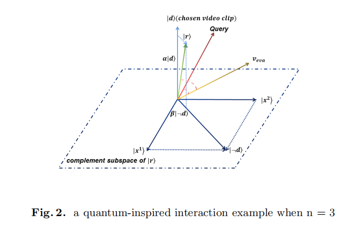

## Abstract

In this project, we present a quantum-inspired interactive video search engine (QIVR), aims at assisting the user in dealing with Known-Item Search and Ad-hoc Video Search tasks with high efficiency and accuracy. QIVR is based on a text-image encoder to achieve multi-modal embedding and introduces multiple interaction possibilities, including a novel quantum-inspired interaction on paradigm, label search, and multi-modal search to refine the retrieval results via user's interaction and feedback.  

## Approach

### Quantum-Inspired Interaction for Clips Re-ranking

Following the great leap in quantum-inspired information retrieval , our system introduces a novel quantum-inspired interaction paradigm to model the
user's interaction.\
After the first-round retrieval, the user can choose the shown video clips that are highly or not consistent with user's demands. With those chosen clips, we can get
an estimation about the user's true demands by applying the quantum-inspired method(see details in the paper). The user's true demands can be regarded as the space spanned by the chosen clip vector and its complement subspace, as shown in Fig.2.\
With the estimation of user's demand, the final score for re-ranking is defined as follow:
$$Score(v_ {eva})=cosine(q,v_ {eva})+\sum{cosine(r^ {i}_ {f},v_ {eva})}-\sum{cosine(r^ {i}_ {nf},v_ {eva})}$$
where $v_ {eva}$ is the video clip to be evaluated in the next-round, cosine(·) is cosine similarity, q is the query embedding vector, $r^ {i}_ {f}$ is the user's demand generated by the $i^ {th}$ highly consistent video and $r^ {i}_ {nf}$ is the user's demand estimation generated by the $i^ {th}$ not-consistent video.

## Citation

If you find this repository useful, please consider giving ⭐ or citing: